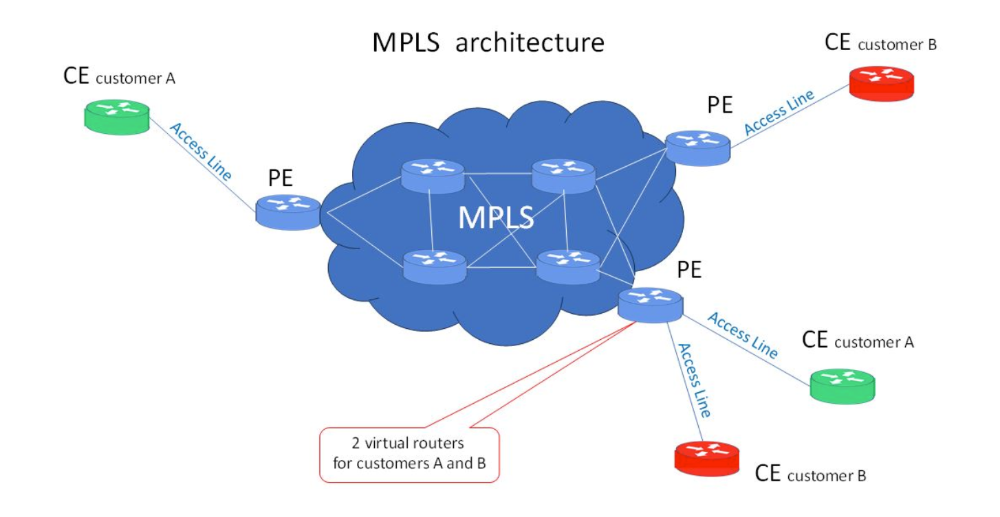
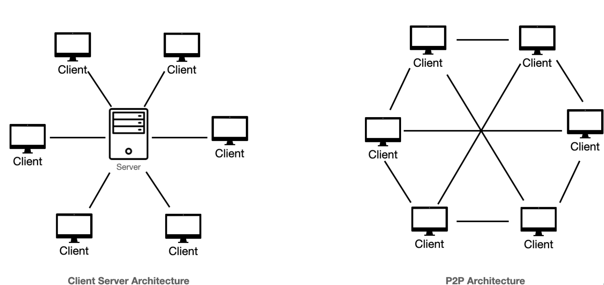
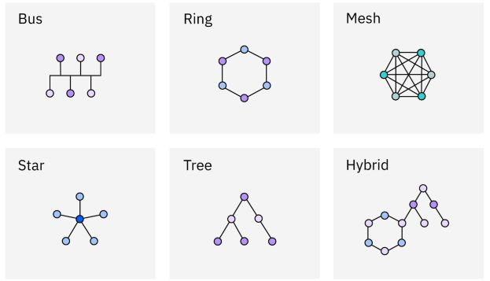

# Introduction to Networks

### 🌐 What’s a Network?

> 📖 **Definition:**  
The dictionary defines a **network** as _"a group or system of interconnected people or things."_

#### 💻 In Computing Terms

In the world of computers, a **network** refers to:

> **Two or more connected computers** that can share:
> - 📁 Data and applications  
> - 🖨️ Office machines (like printers)  
> - 🌍 Internet connections  
> - Or a combination of the above

---

### 🏠 The Local Area Network (LAN)

A **Local Area Network (LAN)** is designed to span a **limited geographic area**, such as:

- 🏢 An office building  
- 🗂️ A single department  
- 🏠 A home office

#### 🕰️ A Bit of History

In the early days, LANs had limitations:

- ❌ No more than 30 workstations
- 📏 Very short distances between devices

Thanks to **technological advancements**, LANs can now span greater distances and accommodate more devices. Still, for manageability, it's a good idea to split a large LAN into **smaller logical zones**, called **workgroups**.

> ⚠️ Note:  
> The term **workgroup** here means a physical network segment, **not** the Windows security model where workgroups lack centralized authentication (like a domain).

#### 🧩 Workgroup Arrangement

It's common in businesses to structure LANs by **departmental divisions**:

- 📊 Accounting Workgroup
- 📞 Sales Workgroup
- 📣 Marketing Workgroup

#### 🚫 LAN Limitations

There are two major issues with isolated LANs:

1. 🔌 You must be **physically connected** to a LAN to use its resources  
2. 🔄 You **cannot access** resources on another LAN remotely

#### 🔁 Enter the Router!

To resolve these limitations, we use a **router**
- Routers connect **networks**  
- Switches and hubs connect **devices** within a network

#### 🧠 Why Not Just One Big LAN?

You might wonder: _"Why not just wire everything together?"_

🚫 That creates a **single large workgroup**, which causes:

- 🐢 Slower performance (many hosts competing for resources)
- 😵 Harder network management

✅ Using **multiple, smaller LANs** connected by routers gives you:

- ⚡ Faster access to resources
- 🔐 Easier administration
- 🔁 Logical separation of departments

---

### 🔧 Common Network Components

Modern networks are made up of many devices and technologies, but here are three of the **most common components**:

- 💻 **Workstations**
- 🖥️ **Servers**
- 🌐 **Hosts**

#### 💻 Workstations

Workstations are often **powerful computers** that may run multiple CPUs and have high processing power. They're used by **end users** for daily tasks.

🔹 People often confuse the terms, so here’s a quick breakdown:

- **Workstation:** A powerful computer used daily, often by end users.
- **Client:** Any device that requests access to resources.
- **Host:** Any device on the network that has an **IP address**.

> 💡 While "workstation", "client", and "host" are used interchangeably in casual language, they have **technical distinctions** in networking.

#### 🖥️ Servers

Servers are high-performance computers that **serve resources** and manage network operations through specialized **Network Operating Systems (NOS)**.

✨ Servers are usually **dedicated to specific tasks** for better performance. Common server types include:

- 📁 **File Server:** Stores and shares files
- 📬 **Mail Server:** Manages email services
- 🖨️ **Print Server:** Controls network printers
- 🌐 **Web Server:** Hosts websites and handles HTTP
- 📠 **Fax Server:** Sends/receives faxes
- 🧩 **Application Server:** Runs specific applications
- ☎️ **Telephony Server:** Handles voice services and call routing
- 🧱 **Proxy Server:** Acts on behalf of clients, often for internet access

> 🔐 Servers usually have **stronger security**, more storage, and higher memory than regular workstations. They are often placed in **secure server rooms**.

#### 🌐 Hosts

In networking, a **host** refers to any device that has an **IP address** and participates in a network.

🦖 Historically, the term "host" was used to describe mainframes, while other terminals were considered "dumb". Today, the term refers to:

- Workstations
- Servers
- Printers
- Phones
- Any IP-enabled device

---

### 🌍 Wide Area Network (WAN)

Many people use WANs daily without realizing it—especially the biggest WAN of all: **the Internet**!

#### 🌐 What is a WAN?

A **Wide Area Network** spans large geographic distances 🌎 and connects remote networks, cities, or even countries.

- Used to **connect multiple LANs** together.
- Employs **routers** and typically uses **public links** like the Internet, telephone lines, or leased lines.
- The **Internet** is the most well-known example of a distributed WAN.

#### 🔍 WAN vs LAN – Key Differences

| Feature              | LAN 🖥️                        | WAN 🌍                              |
|---------------------|-------------------------------|-------------------------------------|
| 📍 Area Covered      | Small (single building)       | Large (cities, countries)           |
| 🚀 Speed             | Typically faster              | Usually slower                      |
| 🔌 Connectivity      | Always connected              | Can be on-demand or dedicated       |
| 🔧 Equipment         | Switches, hubs                | Routers, modems                     |
| 💸 Cost              | Lower                         | Higher                              |
| 📡 Media Used        | Ethernet cables, Wi-Fi        | Phone lines, fiber, satellite, etc. |

#### 🔁 Internetworking (🌐 Internet)

- The **term "Internet"** comes from **internetwork**, which refers to connecting multiple smaller networks.
- Hosts use:
  - **MAC addresses** (🆔) for communication *within* the LAN.
  - **IP addresses** (🌐) to talk to devices *outside* the LAN.
- **Routers** 📦 create internetworks by connecting different LANs and allowing access to WANs like the Internet.

#### 🏢 Centralized vs Distributed WAN

- **Distributed WAN**: Like the Internet—many independent nodes connected together 🌍.
- **Centralized WAN**: A central location (HQ) connects with multiple remote sites 🏢➡️🏢➡️🏢.

#### 🏷️ MPLS (Multiprotocol Label Switching)

🌟 **MPLS** is one of the most popular WAN technologies due to its **speed**, **flexibility**, and **efficiency**.

###### 🚀 Key Benefits of MPLS:
- ⚙️ **Flexible physical layout**
- 📊 **Data prioritization** (e.g., voice over data)
- ♻️ **Redundancy** – multiple paths in case of link failure
- 🔗 **One-to-many** connections possible

###### 🔄 How MPLS Works:
- Data is assigned **labels (numbers)** at the edge of the MPLS network.
- Inside the MPLS "cloud" ☁️, forwarding is based on these labels (not IPs).
- Enables **virtual links** across the network for faster routing.

#### 📌 In Summary:
- WANs connect remote locations across long distances 🌐.
- Routers enable communication across LANs and WANs.
- The Internet is a **distributed WAN**.
- **MPLS** optimizes data transfer across WANs using labels and virtual routing for better performance and redundancy 🔁.

---

#### 🖥️ Network Architecture: Peer-to-Peer vs Client-Server

Networking enables resource and information sharing, structured mainly by the network operating system architecture. There are two main types:

##### 🤝 Peer-to-Peer Networks
- No central authority; all computers are equal peers.
- Each computer can act as both client and server.
- Security and resource access managed locally on each machine.
- Works well for small networks with few users.
- Common in local LAN workgroups using Windows, Mac, or Unix.
- Challenges:
  - ❗ Difficult to manage backups and data consistency.
  - 🔓 Security issues due to decentralized password management.
  - 📝 Users must maintain passwords on each machine, often inconsistently.

##### 🖥️ Client-Server Networks
- Central server manages the entire network using a network operating system.
- Client machines request resources from the central server.
- Server handles security, access rights, and directs clients to resources.
- Advantages:
  - 📂 Centralized resource storage and management.
  - 🔐 Stronger security via centralized authentication.
  - 📈 Highly scalable to many workstations.
  - 🚀 Optimized network performance despite many clients.
- The server is dedicated and never used as a workstation.

##### 🔄 Hybrid Networks
- Many modern networks combine peer-to-peer and client-server architectures.
- Allows workstations to share resources while benefiting from server control.
- Supports simultaneous resource sharing with some server services on workstations.
- Designed well, hybrids leverage the strengths of both models.

### 🌐 Physical Network Topologies

Physical topology maps the actual physical layout of devices and cables in a network, while logical topology shows how data flows.

#### Common Physical Topologies

###### 1. 🚌 Bus Topology
- Single main cable with two terminated ends.
- Devices connect along this single cable.
- ✅ Easy and inexpensive to install, uses less cable.
- ❌ Difficult to troubleshoot, low fault tolerance (one cable failure affects entire network).

###### 2. ⭐ Star Topology
- Devices connect individually to a central hub, switch, or access point.
- ✅ More fault tolerant; failure of one cable affects only that device.
- ✅ Easy to add or move devices, easier troubleshooting.
- ❌ More cable needed, single point of failure at the central device.
- 🔄 Variants: Point-to-point links and wireless star topology.

###### 3. 🔄 Ring Topology
- Devices connected in a closed loop; data flows in one direction.
- ❌ Adding devices requires breaking the ring, causing downtime.
- ❌ Difficult to reconfigure, not fault tolerant.
- ⚠️ Rare in LANs today but still used in WANs like SONET.

###### 4. 🌐 Mesh Topology
- Every device connects directly to every other device.
- ✅ High fault tolerance and redundancy.
- ❌ Complex and expensive due to many connections.
- ⚖️ Full mesh rare; partial mesh used in WANs for balance.

###### 5. 🔗 Point-to-Point Topology
- Direct link between two devices (e.g., routers).
- Used in WANs (like T1 lines) and direct device connections.
- ❌ Not very scalable.

###### 6. 📡 Point-to-Multipoint Topology
- One device connects to multiple devices.
- Common in WANs connecting branch offices or campuses.

###### 7. ⚙️ Hybrid Topology
- Combination of two or more topologies in one network.
- Example: Star-connected hosts with a bus topology backbone.

**Key Concept:**  
- 📍 Physical topology = physical layout and cabling.  
- 🧭 Logical topology = path data takes through the network.  
- 🛡️ Fault tolerance is critical; more connections mean higher fault tolerance but increased complexity and cost.

---

### 🧠 Topology Selection, Backbones, and Segments

#### 🎯 Selecting the Right Topology

Choosing the best network topology depends on your needs, such as:

- 💰 **Budget:** How much money do you have?  
- 🛡️ **Fault tolerance & security:** How reliable and secure must the network be?  
- 📈 **Scalability:** Will the network grow quickly and need frequent reconfiguration?  

##### 💡 Examples:

- For a **small room with few computers**, a **wireless access point** with wireless network cards is cost-effective and easy to set up—no need for lots of cables.  
- For a **growing company with a large network**, a **wired star topology** works well for scalability and easy future changes.  
- For an **ISP requiring 99.9% uptime with less than 8 hours downtime per year**, a **hybrid or partial mesh topology** offers strong fault tolerance.  

> ⚠️ Note: Partial mesh requires maintaining many connections, potentially increasing maintenance costs.

##### 📋 Factors to Consider When Selecting Topology:

- 💸 Cost  
- 🛠️ Ease of installation  
- 🔧 Ease of maintenance  
- 🛡️ Fault-tolerance requirements  
- 🔐 Security requirements  

---

#### 🏗️ The Network Backbone

Networks are often divided into **backbones** and **segments** for clarity and organization.

- The **backbone** acts like the "spine" of the network, connecting all segments and servers.  
- It must be fast and robust, commonly using **Gigabit Ethernet**.  
- All servers and network segments connect directly to the backbone to optimize performance.

#### 🧩 Network Segments

- A **segment** is any part of the network connected to, but not part of, the backbone.  
- Segments include groups of workstations and servers organized by department or function.  
- All segments connect back to the backbone, which is the common connecting point.

#### 🌐 Campus Area Network (CAN)

- A **CAN** covers multiple buildings within a campus.  
- It provides data, services, and external connectivity to corporate offices or headquarters.

#### 💾 Storage Area Network (SAN)

- **SANs** are dedicated high-speed private networks for connecting storage devices, separate from the LAN.  
- Typically use **fiber networks** and **storage-specific switches**.  
- Focus on efficient data collection, management, and access.

