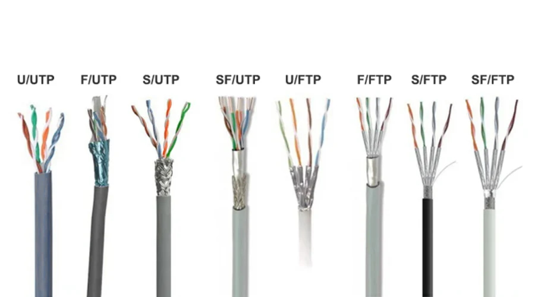
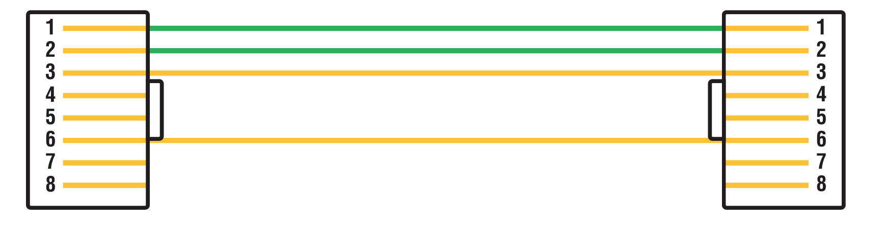
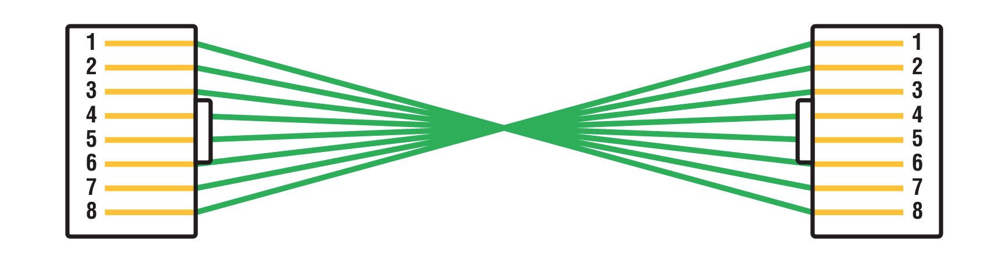
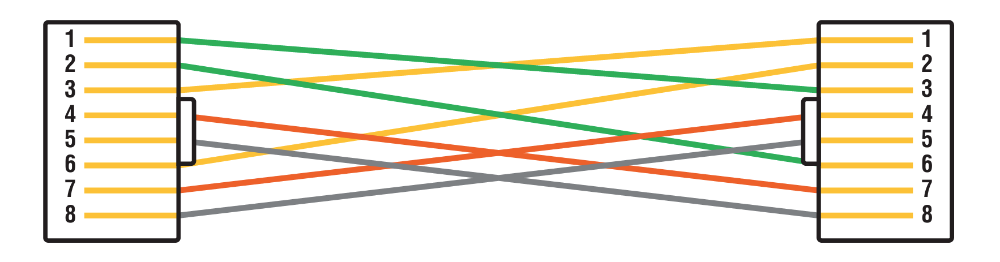

#  Networking Topologies, Connectors, and Wiring Standards

### 🌐 Physical Media in Networking

Although many people use **wireless technologies** (like Wi-Fi, infrared, or Bluetooth), **physical media** remains the **foundation** of most networking infrastructures — even wireless ones connect back to physical cabling!


### 🧵 Common Types of Physical Cables

| Cable Type     | Description                                                                 |
|----------------|-----------------------------------------------------------------------------|
| 🔌 **Coaxial**     | Shielded cable with a central copper conductor. Used in older networks, cable TV |
| 🔄 **Twisted-Pair** | Most common in LANs (Cat5e, Cat6). Pairs of wires twisted to reduce interference |
| 🔦 **Fiber Optic**   | Uses light to transmit data. Super-fast and immune to EMI (electromagnetic interference) |

---

### 🌀 Coaxial Cable (Coax)

#### 🧰 Construction

Coaxial cable is made of:


[ Center Copper Conductor ]
↓
[ Dielectric Insulation ]
↓
[ Braided or Foil Shield (Ground) ]
↓
[ PVC or Plenum-rated Outer Jacket ]

- ✅ **Copper Core** – Transmits data
- ✅ **Shielding** – Prevents EMI
- ✅ **Outer Jacket** – Protects the cable; may be plenum-rated


#### 🔥 Plenum vs Non-Plenum Cables

| Feature              | Plenum Cable 🧯                         | Non-Plenum Cable 🚫                  |
|----------------------|----------------------------------------|--------------------------------------|
| Use Case             | Inside ceilings/floors (air ducts)     | General purpose                      |
| Fire Resistance      | Flame-retardant & low smoke            | Can produce toxic smoke if burned    |
| Material             | Teflon (FEP) or other fire-safe cover  | PVC                                  |
| Cost                 | 💰 More expensive                      | 💸 Cheaper                           |
| Required By Law?     | Yes, in air-handling plenum spaces     | Not in air ducts                     |

> 💡 **Plenum spaces** circulate air for heating/cooling — fire-safe cables are required by building codes.


#### 🧩 Connectors Used

| Component            | Description                                                            |
|----------------------|------------------------------------------------------------------------|
| 🔗 **BNC Connector**     | Bayonet-style connector used to connect coaxial cables               |
| ⚙️ **BNC Crimper Tool**  | Tool to securely crimp BNC connectors to cable ends                  |
| 🔀 **BNC Coupler**       | Connects two BNC cables end-to-end                                   |
| 🧱 **Terminating Resistor** | 50-ohm resistors placed at both ends to prevent signal reflection   |

> 🧠 **BNC** = **Bayonet Neill–Concelman** (named after its inventors)


#### 🖼️ Visual: Coax Cable Layers (Simplified)
```
[FEP or PVC Outer Jacket]
[Metal Shielding (Braided)]
[Plastic Insulator]
[Copper Core Conductor]
```


#### 📺 F-Type Connectors (TV Use)

- **Used for**: Cable television (CATV), satellite TV, cable modems
- **Appearance**: Screw-on tip connector
- **Cables**: Common with **RG-59** and **RG-6**

| Connector Type | Used With | Applications                |
|----------------|-----------|-----------------------------|
| 🔌 BNC          | RG-58     | Networking (legacy Thinnet) |
| 📺 F-Type       | RG-59/RG-6| TV, satellite, broadband    |


#### 📋 Summary

| Feature               | Coaxial Cable                           |
|-----------------------|-----------------------------------------|
| Speed                 | Moderate (older technology)             |
| Interference Shielding| Excellent due to metal shielding        |
| Typical Use           | Cable TV, CCTV, some legacy networks    |
| Connector Types       | BNC, F-Type                             |
| Still Used Today?     | Rarely in LANs, common in video/broadband |


✅ **Coming Next:** Want a breakdown of **Twisted-Pair** or **Fiber Optic** cabling next?

 ---

### 🧵 Twisted-Pair Cable

#### 📌 What is Twisted-Pair Cable?
- Cable consisting of pairs of individually insulated wires twisted together.
- Twisting reduces electromagnetic interference (EMI) and crosstalk (signal interference between adjacent pairs).
- Commonly used in Ethernet networking.

#### 🧰 Types of Twisted-Pair Cable
- **UTP (Unshielded Twisted Pair)**:
  - No additional shielding around the pairs.
  - Most widely used in LANs due to cost and ease of installation.
- **STP (Shielded Twisted Pair)**:
  - Has a foil or braided metal shield around individual pairs or all pairs.
  - Used in environments with high EMI to provide better protection.


#### 🧾 Ethernet Cable Naming Convention

Ethernet cable types follow a structured naming scheme used to indicate their capabilities.

##### 🔤 Format
```
    N<Signaling>X
    (Sometimes written as: N<Signaling>-X)
```
##### 📌 Components

- `N`: Transmission speed in **Megabits per second (Mbps)**.
  - Examples: `10`, `100`, `1000`, `10000`
- `<Signaling>`: Signaling type, usually `Base` (for **Baseband**).
- `X`: Media type / physical layer specification.
  - Examples:
    - `T`   → Twisted Pair
    - `TX`  → Twisted Pair Fast Ethernet
    - `T4`  → Twisted Pair 100 Mbps using 4 pairs
    - `FX`  → Fiber Optic Fast Ethernet
    - `LX`  → Long Wavelength Fiber
    - `SX`  → Short Wavelength Fiber
    - `CX`  → Shielded Copper

##### 🧪 Examples

| Ethernet Standard | Description                                                          |
|-------------------|----------------------------------------------------------------------|
| `10Base-2`        | 10 Mbps, Baseband, Thin Coaxial Cable (Thinnet)                      |
| `10Base-5`        | 10 Mbps, Baseband, Thick Coaxial Cable (Thicknet)                    |
| `10Base-T`        | 10 Mbps, Baseband, Twisted-Pair                                      |
| `100Base-TX`      | 100 Mbps, Baseband, Twisted-Pair (2 pairs, Cat5 or higher)           |
| `100Base-FX`      | 100 Mbps, Baseband, Fiber Optic                                      |
| `1000Base-T`      | 1000 Mbps (1 Gbps), Baseband, Twisted-Pair (4 pairs, Cat5e or Cat6)  |
| `1000Base-LX`     | 1000 Mbps, Baseband, Long-Wavelength Fiber                           |
| `10GBase-T`       | 10 Gbps, Baseband, Twisted-Pair (Cat6a or higher)                    |
| `10GBase-SR`      | 10 Gbps, Baseband, Short-Range Fiber                                 |
| `10GBase-LR`      | 10 Gbps, Baseband, Long-Range Fiber                                  |

##### ✅ Notes

- `Base` means **Baseband**, which sends one signal at a time on the medium.
- The **type of cabling** (copper vs fiber, shielding, number of pairs) is encoded in `X`.
- Speed in the name is **maximum supported throughput**, not guaranteed speed.


##### ⚙️ Why Twisting Matters
- Each pair has a different twist rate to further reduce crosstalk between pairs.
- Prevents internal signal interference (crosstalk).
- Reduces noise pickup from external sources (EMI).


#### 📚 UTP Cable Categories

| Category | Pairs | Max Freq | Max Speed (at 100m unless noted) | Status           |
|----------|-------|----------|---------------------------------|------------------|
| Cat 1    | 2     | ~1 MHz   | Voice only (POTS)               | Obsolete         |
| Cat 2    | 4     | 4 MHz    | Up to 4 Mbps (Token Ring)       | Obsolete         |
| Cat 3    | 4     | 16 MHz   | 10 Mbps Ethernet (10Base-T)     | Obsolete         |
| Cat 4    | 4     | 20 MHz   | 16 Mbps Token Ring              | Obsolete         |
| Cat 5    | 4     | 100 MHz  | 100 Mbps (100Base-TX)           | Obsolete         |
| **Cat 5e**| 4     | 100 MHz  | 1 Gbps (1000Base-T)             | Minimum Recommended|
| **Cat 6** | 4     | 250 MHz  | 1 Gbps (1000Base-T), 10 Gbps (up to 55m) | Preferred        |
| **Cat 6A**| 4     | 500 MHz  | 10 Gbps (10GBase-T)             | Future-proofing  |
| Cat 7    | 4     | 600 MHz  | 10 Gbps (stricter specs than 6A) | Rarely used (proprietary connectors sometimes) |
| Cat 7A   | 4     | 1000 MHz | 10 Gbps (even stricter)         | Rarely used      |
| Cat 8    | 4     | 2000 MHz | 25/40 Gbps (up to 30m)          | Data Centers     |

> 💡 Higher categories are backward compatible with lower ones. Choose based on current and future network speed requirements.


#### 🔌 RJ Connectors

| Connector | Use                          | Wires Used | Pins | Notes                       |
|-----------|-------------------------------|------------|------|-----------------------------|
| RJ-11     | Telephone (DSL, POTS)         | 2, 4, or 6 | 6    | 6P2C, 6P4C, 6P6C. Not for LANs |
| RJ-45     | Ethernet (LAN)                | 8          | 8    | 8P8C. Common in Cat5e/6/6A+ |
| RJ-48c    | T1/WAN (ISDN, E1/T1 lines)    | 8          | 8    | Shielded, similar to RJ-45, specific pinout |


- **T568B** wiring standard (pinout):
  1. Orange/White
  2. Orange
  3. Green/White
  4. Blue
  5. Blue/White
  6. Green
  7. Brown/White
  8. Brown

#### 🛠 Tools
- **Crimping Tool (Crimper)**: Used to attach RJ connectors to the cable ends.
- **Cable Tester**: Verifies continuity and correct wiring.
- **Punch Down Tool**: Used for terminating wires on patch panels and keystone jacks.
- **Wire Stripper**: To remove the outer jacket of the cable.



#### 🛡️ Differences in Twisted-Pair Network Cables Based on Shielding

| Cable Type 📦          | Overall Shield 🌐                 | Pair Shield 🧬                        | Description 📝                                                                 | Protection Level 🌟                          |
|:----------------------:|:----------------------------------:|:------------------------------------:|:-------------------------------------------------------------------------------|:---------------------------------------------|
| **U/UTP**              | None (Unshielded)                 | None (Unshielded)                   | Basic unshielded cable; commonly used in home/office networks.                | ⭐ Very Low                                   |
| **F/UTP**              | Foil Shield                       | None (Unshielded)                   | Foil wrapped around all pairs.                                                | ⭐⭐ Moderate                                  |
| **S/UTP**              | Braided Shield                    | None (Unshielded)                   | Braided metal shielding around all pairs.                                     | ⭐⭐⭐ High                                     |
| **SF/UTP**             | Foil + Braided Shield             | None (Unshielded)                   | Dual shielding (foil + braid) around all pairs.                               | ⭐⭐⭐⭐ Very High                               |
| **U/FTP**              | None (Unshielded)                 | Foil on Each Pair                   | Each pair is individually foil shielded.                                      | ⭐⭐⭐⭐ Very High (Best for Crosstalk)          |
| **F/FTP**              | Foil Shield                       | Foil on Each Pair                   | Foil shielding on both the overall cable and individual pairs.                | ⭐⭐⭐⭐ Excellent                               |
| **S/FTP**              | Braided Shield                    | Foil on Each Pair                   | Braided shield on cable + foil shield on each pair.                           | ⭐⭐⭐⭐⭐ Superior                               |
| **SF/FTP**             | Foil + Braided Shield             | Foil on Each Pair                   | Maximum shielding for both external and internal interference.                | ⭐⭐⭐⭐⭐⭐ Highest (Industrial/Critical Use)     |


#### 🔑 Key Notes

- **U/UTP**: Most common and least expensive; basic interference protection.
- **F/UTP**: Adds foil protection for better EMI resistance.
- **S/UTP**: Uses braided shield for stronger EMI protection.
- **SF/UTP**: Combines foil and braid for robust shielding.
- **U/FTP**: Great for reducing crosstalk between wire pairs.
- **F/FTP, S/FTP, SF/FTP**: Ideal for high-speed networks and noisy environments like industrial settings.
- More shielding = better performance, but more cost, size, and stiffness.

---

### 🌐 Fiber-Optic Cable

Fiber-optic cables transmit **digital signals as light pulses**, making them **immune to EMI (Electromagnetic Interference) and RFI (Radio Frequency Interference)**. This makes them ideal for environments with high interference (e.g., elevator shafts).


#### 🧪 Construction Layers

1. **Core**: Glass (longer distances) or plastic (cheaper)
2. **Cladding**: Reflects light back into the core using a different refraction index
3. **Buffer**: Flexible plastic protective layer
4. **Armor (optional)**: Usually Kevlar for strength
5. **Outer Sheath**: PVC or plenum-rated jacket


#### 🔍 Types of Fiber

##### 1. Single-Mode Fiber (SMF)
- **Core**: Very thin (carries a single light path)
- **Light Source**: Laser or LED
- **Use Case**: Long-distance, high-speed (up to 40 km / ~25 miles)
- **Pros**: Higher speed and distance
- **Cons**: Fragile, harder to install

##### 2. Multimode Fiber (MMF)
- **Core**: Thicker (carries multiple light paths)
- **Light Dispersal**: Multiple rays reflect through the core
- **Use Case**: Short to medium distances (up to 3,000 feet / ~1 km)
- **Material**: Glass or plastic
- **Pros**: Easier and cheaper to install
- **Cons**: Signal loss over longer distances


#### ✅ Pros of Fiber-Optic Cable

- Immune to **EMI/RFI**
- Long-distance transmission (up to **40 km**)
- High bandwidth and speed


#### ❌ Cons of Fiber-Optic Cable

- **Difficult to install**
- **More expensive** than twisted-pair
- **Troubleshooting** requires advanced, expensive tools
- **Fragile**—cannot be sharply bent or pinched


#### 🔌 APC vs. UPC Fiber Connectors

Fiber-optic connectors play a **crucial role in signal quality**, especially when it comes to **return loss**. Two commonly used connector types are:


##### 🔹 UPC (Ultra Physical Contact)

- **Polish**: Flat and highly polished end-face
- **Angle**: 0° (straight cut)
- **Return Loss**: Higher (more signal reflected back into the fiber core)
- **Use Case**: Good for **short-distance** links with minimal signal loss
- **Color Code**: Usually **blue** connectors
- **Advantages**:
  - Lower insertion loss (more light gets through)
  - Easy to clean and connect

- **Disadvantages**:
  - More prone to **back reflections** (return loss)


##### 🔸 APC (Angled Physical Contact)

- **Polish**: Polished at an **8° angle**
- **Angle**: 8° (angled cut)
- **Return Loss**: Significantly **lower** (light reflects into the cladding, not back into the core)
- **Use Case**: Ideal for **long-distance**, **high-frequency**, or **RF-over-fiber** applications
- **Color Code**: Usually **green** connectors
- **Advantages**:
  - Greatly reduced return loss
  - Better performance over long distances

- **Disadvantages**:
  - Slightly higher insertion loss
  - Incompatible with UPC connectors


##### 🔍 Key Differences Table

| Feature              | UPC 🔵                         | APC 🟢                          |
|----------------------|-------------------------------|-------------------------------|
| End Face             | Flat, straight cut            | Angled (8°)                   |
| Reflection           | Reflected back to core        | Reflected into cladding       |
| Return Loss (dB)     | -50 dB (approx.)              | -60 dB or better              |
| Connector Color      | Blue                          | Green                         |
| Ideal Use Case       | Short-distance, LANs          | Long-distance, high-precision |
| Compatibility        | Only with other UPCs          | Only with other APCs          |


#### 🔷 Common Fiber-Optic Connectors

##### 1. **ST (Straight Tip) Connector**
- Developed by AT&T
- **Attachment**: Uses a BNC-style twist-lock mechanism
- **Popularity**: Widely used due to easy connect/disconnect
- **Used in**: LANs
- **Compatibility**: Supports both SMF and MMF


###### 2. **SC (Subscriber / Square Connector)**
- **Attachment**: Snap-in latch system (clicks into place)
- **Durability**: Rated for ~1000 mating cycles
- **Usage**: Works with both SMF and MMF
- **More common in**: Data centers, but less used than ST in LANs


###### 3. **FC (Ferrule / Field Connector)**
- **Used in**: Older telecommunications and test equipment
- **Polish Type**: Supports APC and UPC
- **Note**: Rarely seen in modern deployments
- **Looks like**: ST, but with threaded screw-on mechanism


###### 4. **SFF (Small Form Factor) Connectors**

###### 🔹 MT-RJ (Mechanical Transfer Registered Jack)
- First widely used SFF connector
- **Size**: 1/3 of SC/ST size
- **Design**:
  - TX and RX strands in one connector
  - Keyed for single polarity
  - Pre-terminated (no polishing or epoxy)
- **Use Case**: Compact switch ports, dense patch panels

##### 🔹 LC (Lucent Connector)
- More popular than MT-RJ in modern use
- **Use Case**: Fibre Channel (SANs), Gigabit Ethernet
- **Design**:
  - Ceramic ferrule
  - Snap-in latch
  - Easier termination than MT-RJ


##### 🔄 Fiber Couplers
- Used to connect two different connectors (e.g., ST to SC)
- **Downside**: Causes signal/power (dB) loss

##### 📦 Fiber Distribution Panel (FDP)
- **Purpose**: Central termination and distribution point
- **Components**:
  - Cable management tray
  - Splice drawer
- **Used in**: Central offices, remote offices, and LANs


##### 🔁 Fiber-Optic Transceivers

###### 🔸 Simplex (Unidirectional)
- One-way communication per fiber strand

###### 🔸 Duplex (Bidirectional)
- Two-way communication
- **Standard**: IEEE 802.3ah (e.g., 1000BASE-BX10-D/U)
- **Mechanism**: Uses different wavelengths for Tx and Rx on a single strand


##### 🧠 Summary Table

| Connector | Size         | Lock Type    | Use Case           | Fiber Type | Notes                           |
|-----------|--------------|--------------|---------------------|------------|----------------------------------|
| ST        | Standard     | Twist (BNC)  | LANs, general       | SMF/MMF    | Easy connect/disconnect          |
| SC        | Standard     | Push-latch   | Data centers        | SMF/MMF    | Durable, ~1000 connections       |
| FC        | Standard     | Screw-on     | Telecom/test gear   | SMF        | Rarely used, legacy              |
| MT-RJ     | Small        | Clip         | High-density ports  | MMF        | First SFF, paired fibers         |
| LC        | Small        | Push-latch   | SANs, Gigabit Eth.  | SMF/MMF    | Most common SFF today            |


📌 *Tip: Always match connector types and polish types (APC vs UPC) to ensure signal quality and physical compatibility!*

---


### 🔌 Serial Cables & USB


#### 🔹 What Is a Serial Cable?

- **Serial communication**: Data is transmitted **one bit at a time** over a wire or fiber.
- Each bit (`0` or `1`) is **sent in sequence** and reassembled at the destination.
- ⚠️ **Different from parallel** communication, where **multiple bits are sent at once** (e.g., old printer cables).


#### 📡 RS-232 Standard

##### 🧾 RS-232 (Recommended Standard 232)
- **Used for**: Serial communication between **DTE (Data Terminal Equipment)** and **DCE (Data Communications Equipment)**.
- **Typical use**: Connecting a **PC serial port** to an **external modem**.
- **Connector type**: Often **DB-9** (9-pin D-sub connector).

📉 **Status**: Obsolete on modern laptops, replaced by USB, Thunderbolt, and FireWire.

#### 🔌 DB Connectors

##### 🧾 DB-25
- **Definition**: "DB" stands for **D-subminiature**, and **25** means it has **25 pins**.
- **Shell size**: "B" size (from D-series: A, B, C, D, E).
- **Use case**: Previously common in **RS-232 communication**.
- ❗ **Legacy** connector — no longer widely used.

##### 🧾 DB-9
- **Use**: Also RS-232, commonly used for **Cisco console cables**.
- ✅ Replaced mostly by USB-to-serial adapters today.


#### 🔗 USB — Universal Serial Bus

##### 🔋 Features:
- **Modern replacement** for legacy serial and parallel connections.
- **Maximum devices**: Supports up to **127 devices** per controller.
- **Device types**: Keyboards, mice, printers, scanners, joysticks, flash drives, etc.
- **Ports**: Typically 4 external USB ports per motherboard; can be expanded with hubs.

##### 🧰 USB Connections:
- **Direct connection** to PC USB port, or
- Through a **USB hub** (can be chained).

##### 🧩 USB Plug:
- USB plugs come in different types (Type-A, Type-B, Micro, Mini, USB-C).
- Each device has a **standardized USB connector**.


##### 🔌 USB Connector Types

| USB Type       | Shape & Design                                | Common Use Cases                              | Features / Differences                                  |
|----------------|-----------------------------------------------|------------------------------------------------|----------------------------------------------------------|
| **USB Type A** | Rectangular, flat                              | PCs, Laptops, TVs, Keyboards, Flash Drives     | Standard host connector; widely used for peripherals     |
| **USB Type B** | Square with bevel top corners                  | Printers, Scanners, External Hard Drives       | Designed for peripheral devices; bulky for modern use    |
| **USB 3.0 A**  | Same as Type A but with blue tab               | High-speed storage devices, USB 3.0 hubs       | Backward compatible with Type A; supports higher speeds  |
| **USB Mini**   | Small trapezoidal shape                        | Old digital cameras, MP3 players               | Compact, now mostly obsolete                             |
| **USB Micro**  | Smaller, flatter than Mini                     | Android phones, older portable devices         | Replaced Mini USB; very thin but fragile                 |
| **USB Type C** | Oval, reversible connector                     | Modern phones, laptops, tablets, MacBooks      | Reversible; supports high-speed data, video, power       |
| **USB Micro B**| Dual connector shape (Micro B + extra pins)    | USB 3.0 external hard drives                   | For high-speed USB 3.0 connections to portable devices   |


#### 🧠 Comparison Table

| Feature       | Serial (RS-232)      | Parallel          | USB (Modern)         |
|---------------|----------------------|-------------------|-----------------------|
| Transmission  | 1 bit at a time      | Multiple bits     | Multiple types        |
| Speed         | Slow                 | Faster (than serial) | High (USB 3.0/4.0+) |
| Connectors    | DB-9, DB-25          | Centronics        | Type-A, C, Micro-USB  |
| Relevance     | Obsolete             | Obsolete          | Current standard      |
| Max Devices   | 1:1 Connection        | N/A               | Up to 127             |


📌 **Key Takeaway**:
- Serial cables like RS-232 are **legacy tech**.
- USB is the **standard interface** for modern devices, offering speed, flexibility, and ease of use.

---

### 🔧 Cable Properties

Networking cables differ in performance based on several key properties. Understanding these helps choose the right cable for the right task.


#### ⚡ Transmission Speeds
- Varies by cable type and network design.
- Core networks: Usually support **up to 10 Gbps or more**.
- Access layers: Typically **100 Mbps**, but demand is increasing.


#### 📏 Distance
- Signal degrades over long distances (**attenuation**).
- Example: **Twisted-pair cables** have a max segment of **100 meters (328 feet)**.
- Fiber-optic cables can support much longer distances with less attenuation.


#### 🔁 Duplex Modes
- **Half Duplex**: Devices **either send or receive** (e.g., walkie-talkies).
- **Full Duplex**: Devices can **send and receive simultaneously**, doubling efficiency.
- Modern networks typically use **full duplex**.


#### 🛡️ Noise Immunity & Security (EMI)
- Copper wires generate electromagnetic fields, which can:
  - Be **tapped** (eavesdropping risk).
  - Be affected by external electromagnetic interference (**EMI**).

- **Shielded Twisted Pair (STP)** reduces but doesn't eliminate tapping risk.
- **Fiber-optic cables** are immune to EMI and very hard to tap:
  - Use **light** instead of electricity.
  - Tapping requires physical splicing, which is hard to do unnoticed.

- Avoid running copper near:
  - Motors
  - Speakers
  - Fluorescent lights
  - Anything generating magnetic fields


#### 📡 Frequency (Bandwidth Capacity)
| Cable Type | Max Frequency | Max Speed      | Notes                                 |
|------------|----------------|----------------|----------------------------------------|
| Cat 5e     | 100 MHz        | 1 Gbps         | Good for short high-speed connections  |
| Cat 6      | 250 MHz        | 1 Gbps+        | Better insulation and twist; great for inter-floor links |


💡 **Key Takeaway**: Choose cables based on the required **speed, distance, EMI immunity, and duplex** needs of the network area.

---

### 🧰 Ethernet Wiring Standards

Ethernet cables follow specific wiring standards to ensure reliable communication. Key standards include:


#### 📘 T568A vs. T568B

Both standards use **4 twisted wire pairs** inside the Ethernet cable, but assign colors to pins differently:

| Pin | T568A Color         | T568B Color         |
|-----|----------------------|----------------------|
| 1   | White/Green         | White/Orange        |
| 2   | Green               | Orange              |
| 3   | White/Orange        | White/Green         |
| 4   | Blue                | Blue                |
| 5   | White/Blue          | White/Blue          |
| 6   | Orange              | Green               |
| 7   | White/Brown         | White/Brown         |
| 8   | Brown               | Brown               |

|  |  |
|----------------|----------------|

- Only **pins 1, 2, 3, and 6** are used for 10/100 Mbps Ethernet data.
- Use **the same standard on both ends** for straight-through cables.


#### 🔌 Cable Types

##### 1. 🟩 Straight-Through Cable

- **Same standard on both ends** (T568A-T568A or T568B-T568B)
- Used for:
  - Host → Switch/Hub
  - Router → Switch/Hub

##### 2. 🔁 Crossover Cable

- **Different standards on each end** (T568A-T568B)
- Swaps transmit & receive wires:
  - Pin 1 ↔ Pin 3
  - Pin 2 ↔ Pin 6
- Used for:
  - Switch ↔ Switch
  - Hub ↔ Hub
  - Host ↔ Host
  - Hub ↔ Switch
  - Router ↔ Host


##### 3. ⚙️ Rolled/Rollover Cable
- All pins are **reversed**:
  - Pin 1 ↔ Pin 8
  - Pin 2 ↔ Pin 7
  - ...
- Used to connect a **PC (serial port)** to a **router/switch console port**.
- Often used with **Cisco devices** for configuration via **COM ports**.


##### 4. 🚀 Gigabit UTP (1000BaseT)
- Requires **4 wire pairs (8 wires total)**.
- All pairs transmit **simultaneously**.
- Wiring is still **1 to 1, 2 to 2, ..., 8 to 8**.
- Common in **data centers and high-speed LANs**.


##### 5. 🛰 T1 Crossover Cable
- Used to connect **two CSU/DSUs** back-to-back.
- Pin connections:
  - 1 ↔ 4
  - 2 ↔ 5
  - 4 ↔ 1
  - 5 ↔ 2
- Utilizes only **pins 1, 2, 4, and 5**.
- Important for **T1 Internet connections** in enterprise environments.


#### 🧪 Cable Testing

A **cable tester** is essential for:
- Verifying cable type: straight-through, crossover, or rolled.
- Checking for wiring faults or improper crimping.
- Ensuring proper pinout and electrical continuity.

🛠️ A simple hand-held UTP tester can help confirm correct connections before installation.


#### 🧠 Quick Reference Table

| Cable Type        | End A        | End B        | Pins Used         | Common Use                                     |
|-------------------|--------------|--------------|--------------------|------------------------------------------------|
| Straight-Through  | T568A        | T568A        | 1,2,3,6 (4 pairs for Gigabit) | Host ↔ Switch, Router ↔ Switch     |
| Straight-Through  | T568B        | T568B        | 1,2,3,6            | Host ↔ Switch (alternative standard)           |
| Crossover          | T568A        | T568B        | 1↔3, 2↔6          | Host ↔ Host, Switch ↔ Switch                   |
| Rolled/Rollover    | Reversed     | Reversed     | 1↔8, 2↔7, ...      | PC ↔ Cisco Console Port (serial)              |
| Gigabit Ethernet   | T568A/B      | T568A/B      | All 8 pins         | High-speed Host ↔ Switch (1000BaseT)          |
| T1 Crossover       | Custom       | Custom       | 1↔4, 2↔5, 4↔1, 5↔2 | CSU/DSU ↔ CSU/DSU (back-to-back T1)           |

---
