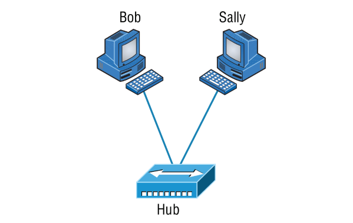
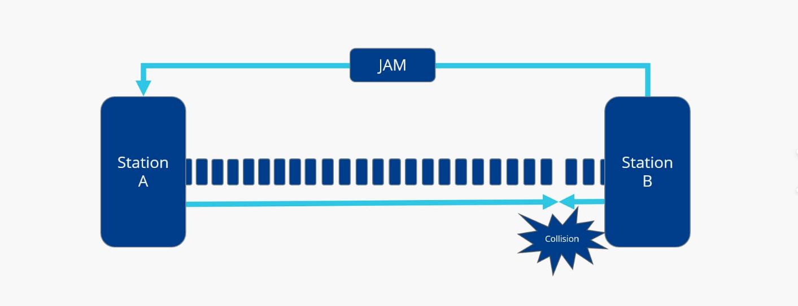
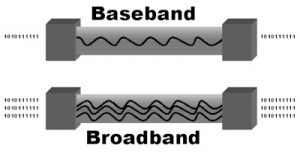
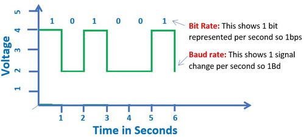
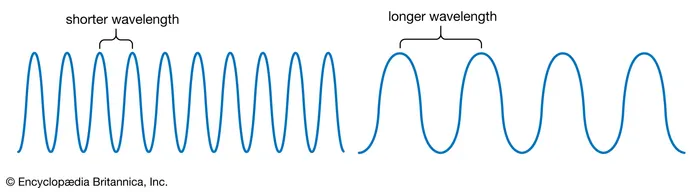
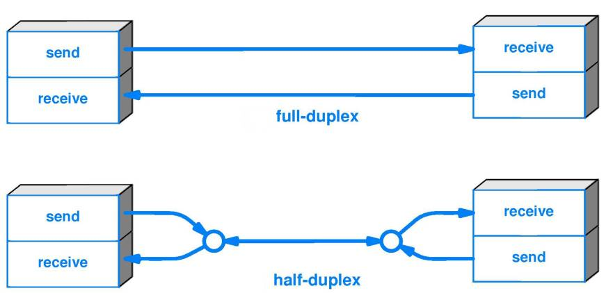

# 🌐 The Current Ethernet Specifications

## 🧠 Network Basics

- Networks have evolved rapidly due to rising demands like:
  - Data sharing
  - Printer access
  - Videoconferencing
- Most users aren't in the same location, so **network interconnection** is essential.


### 🖧 Example: Simple LAN Communication


### 📍 Setup:
- A **local area network (LAN)** connects multiple PCs via a **hub** (multiport repeater).
- The entire LAN = **1 collision domain + 1 broadcast domain**

#### 🧍💬 How Bob Talks to Sally

##### ❌ Wrong Ideas:
- Bob doesn’t send: `"Hey Sally!"`
- Bob doesn’t send: `"Hey 192.168.0.3!"`

##### ✅ Correct:
> Bob sends a message using **Sally’s MAC address** (hardware address).


#### 🤔 But... How Does Bob Get Sally’s MAC?

##### Step-by-step Process:

##### 1. 🧭 Name Resolution via NBNS

- Bob knows only Sally’s NetBIOS name ("SALLY").
- Bob sends a **broadcast NBNS query** to resolve the name to IP.

NBNS Query:
```
Time        Source        Destination     Protocol   Info
53.892794   192.168.0.2   192.168.0.255   NBNS       Name query NB SALLY<00>
```

- L3 Broadcast IP: `192.168.0.255`
- L2 Broadcast MAC: `ff:ff:ff:ff:ff:ff`

✅ Sally receives the NBNS query and extracts:
- Bob’s IP from the IP header
- Bob’s MAC from the Ethernet frame

She sends a **unicast NBNS response** directly to Bob:

NBNS Response:
```
Time        Source        Destination     Protocol   Info
53.893170   192.168.0.3   192.168.0.2     NBNS       Name query response NB 192.168.0.3
```


##### 2. 📡 MAC Resolution via ARP

- Now Bob knows Sally’s IP (`192.168.0.3`) but **not her MAC**.
- He sends an **ARP request (broadcast)** to find out who owns that IP.

ARP Request:
```
Time        Source        Destination     Protocol Info
5.153054    192.168.0.2   Broadcast        ARP      Who has 192.168.0.3? Tell 192.168.0.2
```

✅ Sally responds with a **unicast ARP reply**, giving her MAC address:

ARP Reply:
```
Time        Source        Destination     Protocol Info
5.153403    192.168.0.3   192.168.0.2      ARP      192.168.0.3 is 00:0b:db:99:d3:5e
```

##### ✅ Final Result:
- Bob has Sally’s IP: `192.168.0.3`  
- Bob has Sally’s MAC: `00:0b:db:99:d3:5e`  
- Communication can now proceed via unicast.


#### 🔁 What About Sally?

- Sally **also needs to resolve Bob’s info** (IP + MAC) before replying.
- This two-way resolution is **normal in Windows IPv4 networks**.


| Step | Action                                | Protocol     | Layer         |
|------|----------------------------------------|--------------|----------------|
| 1    | Name → IP (if needed)                  | NBNS / DNS   | Application    |
| 2    | IP → MAC                               | ARP          | Data Link      |
| 3    | Use MAC to send data over Ethernet     | Ethernet     | Data Link      |


#### 🧩 Key Concepts in This Process

| Concept                | Description                                                                 |
|------------------------|-----------------------------------------------------------------------------|
| **MAC Address**        | A hardware address assigned to each network interface card; identifies the device on Layer 2. |
| **IP Address**         | A logical address used to identify a device on the network; enables routing on Layer 3.        |
| **Broadcast**          | A message sent to all devices on the network segment.                        |
| **ARP (Address Resolution Protocol)** | A protocol used to resolve an IP address into a MAC address.              |
| **Name Resolution**    | The process of translating a hostname (e.g., Nora) into an IP address, usually via DNS or NBNS. |


When a computer wants to send a message to another computer on the network, it must:

1. **Resolve the name to an IP address.**
2. **Resolve the IP address to a MAC address (using ARP).**
3. **Send the actual message using the MAC address.**
4. **The recipient follows the same process to respond.**

This is one of the fundamental processes in **Local Area Networks (LANs)**, especially for **Ethernet communication**.

---

## 📚  Ethernet Basics

### 🧩 What is Ethernet?
- A widely used LAN technology that allows all connected devices to share bandwidth.
- Works using a **contention-based** access method.
- Operates at:
  - **Layer 1 (Physical)**: Handles signaling, cabling, etc.
  - **Layer 2 (Data Link)**: Manages framing, addressing (MAC), and error detection.
- Popular due to:
  - Scalability (easy upgrades to Fast/Gigabit Ethernet)
  - Simplicity in deployment and troubleshooting


### ⚡ Collision Domain

A **collision domain** refers to a section of a network where data packets can "collide" with one another when sent simultaneously by multiple devices.

#### 🧠 Concept:
- When **one device** sends a packet on a network segment, **all devices** on that segment must listen.
- If **two devices** transmit at the same time ➜ their signals interfere ➜ **collision** happens.
- Devices must then **retransmit** their data, causing **delays and reduced performance**.

#### 📉 Why Collisions Are Bad:
- Collisions lead to:
  - **Network delays**
  - **Increased retransmissions**
  - **Lower throughput**
  - **Congestion in large networks**

#### 🧱 Where Collisions Occur:
- Typically found in **hub-based** Ethernet networks.
- A **hub**:
  - Simply repeats the signal to all connected ports.
  - Creates **one large collision domain** and **one broadcast domain**.

#### 🔧 How to Reduce Collisions:
| Device         | Effect on Collision Domains            |
|----------------|----------------------------------------|
| **Hub**        | All ports in **one collision domain**  |
| **Switch**     | Each port is its **own collision domain** |
| **Router**     | Separates both **collision & broadcast domains** |

> 🔍 **Conclusion**: A collision domain includes all devices that compete for access on the same physical network segment. To improve performance, use **switches** or **full-duplex** links that isolate or eliminate collision domains.


### 📡 Broadcast Domain

A **broadcast domain** is a network segment where **all devices** receive broadcast messages sent by any other device within that segment.


#### 🧠 What Is a Broadcast?
A **broadcast** is a message sent from one device to **all other devices** in the same broadcast domain, usually using a **Data Link Layer (Layer 2)** address (like the MAC address `FF:FF:FF:FF:FF:FF`).


#### 🌐 Broadcast Domain Defined:
- All devices that **hear and respond to broadcasts** sent over the network are within the **same broadcast domain**.
- Broadcast domains are used to **limit the scope** of broadcast traffic and reduce congestion.


#### 🧱 What Defines a Broadcast Domain?
| Device           | Broadcast Domain Effect                                      |
|------------------|--------------------------------------------------------------|
| **Hub**          | One large broadcast domain (no isolation)                    |
| **Switch**       | One broadcast domain per VLAN (Layer 2 segmentation)         |
| **Router**       | **Separates** broadcast domains (Layer 3 boundary)           |

- A **switch** can create multiple broadcast domains using **VLANs**.
- A **router** does **not forward** broadcast packets by default, thus **separating** domains.


#### 🧩 Physical vs Logical Boundaries:
- **Physical Boundary**: Formed by devices like switches and repeaters.
- **Logical Boundary**: Formed by configuration, such as **VLANs** (Virtual LANs), that segment traffic at Layer 2.

#### 🛑 Why Broadcast Domains Matter:
- Too many devices in one broadcast domain ➜ **excessive broadcast traffic**.
- This can lead to:
  - Network **slowness**
  - **CPU overload** on endpoints
  - **Security issues** if broadcasts leak data unintentionally

> 🧭 **Summary**: A broadcast domain includes all the devices that receive broadcasts from any device on the same Layer 2 network segment. Routers break broadcast domains; switches can segment them using VLANs.


### ⚙️ CSMA/CD – Carrier Sense Multiple Access with Collision Detection

**CSMA/CD** is a media access control (MAC) method used in traditional **Ethernet networks** to manage how devices share the network medium and avoid collisions.


#### 🔄 Why CSMA/CD?
- Ethernet is a **shared medium**.
- If two devices transmit **simultaneously**, a **collision** occurs.
- CSMA/CD was designed to **detect and handle collisions**, especially in **half-duplex Ethernet**.


#### 🧪 How CSMA/CD Works – Step by Step:

1. **Carrier Sense**:
   - Before sending, a device **listens** to the wire to check if the line is **idle**.

2. **Transmit**:
   - If the wire is clear, the device **starts transmitting**.

3. **Collision Detection**:
   - While transmitting, the device continues to **monitor** the wire.
   - If it detects another signal (collision), it **stops immediately**.

4. **Jam Signal**:
   - The device sends a **jam signal** to notify all hosts of the collision.

5. **Backoff Algorithm**:
   - All devices wait a **random amount of time** before attempting to retransmit.
   - This is called **exponential backoff**.

6. **Retry**:
   - After the delay, devices **retry transmission**.
   - If a device fails to transmit after **15 attempts**, it **gives up** (times out).


#### 🔁 Collision Response:

| Step                 | Action Taken                                     |
|----------------------|--------------------------------------------------|
| Collision occurs     | Devices send a **jam signal**                    |
| Random backoff       | Devices wait random time (based on algorithm)    |
| Timer expiration     | Devices try to retransmit after waiting          |
| Equal opportunity    | All hosts have equal chance to send again        |


#### ⚠️ Effects of High Collision Rates in CSMA/CD Networks:

- **⏱️ Delay**: Packets take longer to be delivered.
- **📉 Low Throughput**: Less data is successfully transmitted.
- **🌐 Network Congestion**: Too many collisions clog the medium.


#### 🧱 Devices That Help Avoid Collisions:

| Device       | Collision Avoidance Capability        |
|--------------|----------------------------------------|
| **Hub**      | ❌ None – shared collision domain       |
| **Switch**   | ✅ Each port is its own collision domain |
| **Bridge**   | ✅ Separates collision domains           |
| **Router**   | ✅ Separates networks at Layer 3         |

> 🔍 **Note**: CSMA/CD is mostly used in **legacy Ethernet** with **hubs** or **half-duplex links**. It’s **not used** in full-duplex switched Ethernet networks today.


### 🌐 Broadband vs Baseband – Network Transmission Methods

There are **two primary methods** for transmitting signals over a network medium:


#### 🎧 Broadband Transmission

> Used in **home networks**, **cable TV**, and **telecom**.

##### 🔹 Key Features:
- Sends **multiple signals** (analog or digital) at **different frequencies**.
- Uses **Frequency-Division Multiplexing (FDM)** to separate signals.
- Allows **simultaneous communication** on a single cable.
- Can **carry both voice (analog)** and **data (digital)** over the same medium.

##### 📌 Real-World Example:
- **Cable internet**: You can stream Netflix (digital) and have a phone call (analog) over the same coaxial cable.

##### ✅ Pros:
- Efficient use of the medium for **multiple services**.
- **Simultaneous** data and voice transmission.


#### 🖧 Baseband Transmission

> Standard for **LANs (Local Area Networks)** like Ethernet.

##### 🔹 Key Features:
- Uses the **entire bandwidth** for **one signal** at a time.
- Only **digital signals** are sent.
- **No FDM**: One transmission occupies the whole medium.
- Multiple hosts trying to send simultaneously cause **collisions**.

##### 📌 Real-World Example:
- **Ethernet**: Transmits **one digital signal** over a UTP cable. If another host sends at the same time → **collision**.

##### ✅ Pros:
- Simpler and cheaper for short-distance digital networks.
- Well-suited for LANs where devices take **turns** transmitting (e.g., using switches).


#### 📊 Comparison


| Feature            | Broadband                        | Baseband                     |
|--------------------|----------------------------------|------------------------------|
| Signal Type        | Analog + Digital                 | Digital only                 |
| Frequency Use      | Multiple frequencies (FDM)       | Single frequency             |
| Medium Sharing     | Simultaneous signals             | One signal at a time         |
| Example            | Cable TV, DSL                    | Ethernet LAN                 |
| Transmission Style | Continuous parallel transmission | One-at-a-time transmission   |
| Collisions         | Rare (different frequencies)     | Likely without collision control |


#### 🧠 Key Takeaways

- **Broadband** = **Multiple signals, multiple frequencies**, both analog & digital.
- **Baseband** = **Single digital signal**, uses full bandwidth, common in Ethernet.

> ⚠️ **Collision risk** exists in baseband networks unless managed by switching, CSMA/CD, or full-duplex links.


### ⚖️ Bit Rate vs. Baud Rate

Understanding the difference between **bit rate** and **baud rate** is essential in digital and analog communications.


#### 🔢 Bit Rate (bps - bits per second)

#### 📌 Definition:
The **bit rate** measures the **number of data bits (0s and 1s)** transmitted per second.

#### 🧠 Key Points:
- It tells you **how much data** is being transferred.
- Measured in **bps**, **kbps**, **Mbps**, etc.
- Example:  
  - **56,000 bps (or 56 kbps)** = 56,000 bits (0s or 1s) transferred per second.

#### ✅ More Accurate:
Bit rate reflects the **actual amount of data** transmitted and is the **modern standard** used in networking.


#### 🔁 Baud Rate

##### 📌 Definition:
**Baud rate** measures the **number of signal changes** (electronic state changes) per second in a communication channel.

##### ⚙️ Signal Change Example:
- A **signal change** might be from **0.2 volts to 3 volts**, or from **binary 0 to 1**.
- 1 baud = **1 symbol/transition per second**.

##### ⚠️ Not Always 1:1 With Bits:
- In early systems (like telegraphs), 1 baud = 1 bit.
- But in modern systems, **1 signal change can represent multiple bits** (e.g., using modulation techniques).
  - Example: A signal carrying **4 bits per change** at 1,000 baud = **4,000 bps**.

#### 🧮 Comparison


| Feature           | Bit Rate (bps)                    | Baud Rate                      |
|------------------|-----------------------------------|--------------------------------|
| Measures          | Number of bits transmitted         | Number of signal changes       |
| Modern Usage      | Preferred, more accurate           | Legacy term (less used today)  |
| 1 unit equals     | 1 bit per second                   | 1 signal state change per sec  |
| Can differ?       | Yes, can be higher than baud rate  | Yes, may carry multiple bits   |
| Example Value     | 56,000 bps = 56k bits per sec      | 1,200 baud (old modem speeds)  |


- 📈 **Bit rate (bps)** is the **actual data rate** and what we mostly use today.
- 🔄 **Baud rate** refers to the **rate of signal transitions**.
- The **bps unit replaced baud** because it provides a clearer picture of real data throughput.

> 🏁 Think of baud rate as how **often** a change occurs, and bit rate as **how much data** is sent with each change.

### 🌊 Wavelength

#### 📖 What Is Wavelength?

In networking and electromagnetic communication, a **wavelength** refers to the **distance between the peaks (high points)** of a wave. This concept applies to **radio waves**, **light waves**, **infrared waves**, and other forms of **electromagnetic radiation**.


#### 🎯 Real-Life Analogy

> Have you ever heard someone say:
> - “We’re on the same wavelength”?  
> - Or “We’re not on the same wavelength”?

💡 This metaphor comes from the concept of actual electromagnetic waves:
- If two wave patterns are **aligned** (same shape and length), they are **on the same wavelength**.
- If the patterns differ, they are **not on the same wavelength**.


#### 🧪 Scientific Breakdown

| **Term**         | **Explanation**                        |
|------------------|----------------------------------------|
| **Wave**         | A repeating pattern of energy in space |
| **Peak**         | The highest point of a wave            |
| **Wavelength**   | Distance between consecutive peaks     |

📏 **Wavelength is measured in units like nanometers (nm)** for light or **meters (m)** for radio waves.



#### 📶 Why Wavelength Matters in Networking

In electronics and networking, **different signals can be transmitted on different wavelengths at the same time**, allowing for **parallel communication**.

##### ✅ Practical Uses:
- **Fiber optics** use multiple wavelengths to send data streams simultaneously (WDM - Wavelength Division Multiplexing).
- **Radio communications** assign different frequencies (and wavelengths) to different stations to avoid interference.
- **Infrared** and **microwaves** have unique wavelengths used for Wi-Fi, remotes, and radar.

#### 🧠 Key Takeaways

- **Wavelength** is the distance between wave peaks.
- It helps us **identify** and **separate** different types of electromagnetic energy.
- In networking, it allows **simultaneous signal transmission** over shared media.


### 🔄 Half- and Full-Duplex Ethernet

Ethernet can operate in **two duplex modes**: **Half-Duplex** and **Full-Duplex**. These modes determine how data is transmitted and received across the network.


#### ⚙️ Half-Duplex Ethernet

- **Defined by**: Original IEEE 802.3 specification.
- **How it works**: 
  - Uses **one wire pair**.
  - Can **transmit or receive**, but **not at the same time**.
- **Collision Handling**:
  - Uses **CSMA/CD** (Carrier Sense Multiple Access with Collision Detection).
  - Listens for digital signals to avoid collisions.
  - Retransmits if a collision occurs.
- **Typical Performance**:
  - Example: **10BaseT** networks are **30–40% efficient**.
  - Throughput often only **3–4 Mbps** even though 10 Mbps is the rated speed.
- **Modern Use**: Rarely used today, especially in **100 Mbps and higher networks**.


#### ⚡ Full-Duplex Ethernet

- **Uses**: **Two pairs of wires**—one for transmit, one for receive.
- **Data Flow**: Allows **simultaneous transmit and receive** (bi-directional).
- **Collision-Free**:
  - No need for CSMA/CD.
  - Acts like a **multi-lane freeway** (vs. single-lane half-duplex).
- **Connection Type**:
  - Requires **point-to-point** links (e.g., host ↔ switch).
- **Efficiency**: Theoretically up to **100% in both directions**.

##### 📊 Examples of Full-Duplex Speeds:

| Ethernet Type    | Speed       | Full-Duplex Rate |
|------------------|-------------|------------------|
| 10 Mbps Ethernet | 10 Mbps     | 20 Mbps total    |
| Fast Ethernet    | 100 Mbps    | 200 Mbps total   |

> These are **aggregate speeds**—actual throughput depends on network conditions.

#### 🔁 Full-Duplex Connection Scenarios

✅ Can be used in:

- Switch ↔ Host  
- Switch ↔ Switch  
- Host ↔ Host (with **crossover cable**)


#### 🧠 Auto-Detect Mechanism

When a device is powered on:

1. **Negotiates** speed (10/100/1000 Mbps).
2. **Checks** for full-duplex capability.
3. **Falls back** to half-duplex if needed.

- Most NICs today support **auto-detection** of both speed and duplex mode.
- Settings can be **manually configured** on network cards if necessary.


## Ethernet at the Data Link Layer 

### 🧮 Binary to Decimal and Hexadecimal Conversion


#### 📌 Key Concepts

| Term        | Description                                                                 |
|-------------|-----------------------------------------------------------------------------|
| **Bit**     | A binary digit: either `0` or `1`.                                           |
| **Nibble**  | 4 bits (e.g., `1101`).                                                       |
| **Byte**    | 8 bits (e.g., `10101100`). Also called an **octet** in networking.           |
| **Decimal** | Base-10 number system (0–9).                                                 |
| **Hex**     | Base-16 system using digits `0–9` and letters `A–F`.                         |


#### 🔢 Binary → Decimal Conversion

To convert binary to decimal:
- Each **bit position** has a value based on powers of 2.
- Add up the **values of the ON bits (1s)**.

##### ✅ Example: `10010110`

| Bit Position (from left) | 128 | 64 | 32 | 16 | 8 | 4 | 2 | 1 |
|--------------------------|-----|----|----|----|---|---|---|---|
| Bit Value                | 1   | 0  | 0  | 1  | 0 | 1 | 1 | 0 |
| Decimal Value            | 128 | 0  | 0  | 16 | 0 | 4 | 2 | 0 |

**Decimal = 128 + 16 + 4 + 2 = 150**


#### 🧮 Binary → Hexadecimal Conversion

**1 nibble = 1 hex digit**

##### ✅ Method:

1. Break the binary byte into 2 **nibbles** (4 bits each).
2. Convert each nibble to hex using a reference table or direct calculation.

##### 📊 Nibble to Hex Table

| Binary | 0000 | 0001 | 0010 | 0011 | 0100 | 0101 | 0110 | 0111 | 1000 | 1001 | 1010 | 1011 | 1100 | 1101 | 1110 | 1111 |
|--------|------|------|------|------|------|------|------|------|------|------|------|------|------|------|------|------|
| Hex    | 0    | 1    | 2    | 3    | 4    | 5    | 6    | 7    | 8    | 9    | A    | B    | C    | D    | E    | F    |
| Decimal | 0  | 1  | 2  | 3  | 4  | 5  | 6  | 7  | 8  | 9  | 10 | 11 | 12 | 13 | 14 | 15 |


- **Hex ↔ Binary** is easiest when using nibbles.
- **Decimal ↔ Binary** requires understanding the powers of 2:
  
| Bit Position | 7 | 6 | 5 | 4 | 3 | 2 | 1 | 0 |
|--------------|---|---|---|---|---|---|---|---|
| Power of 2   |128|64 |32 |16 |8  |4  |2  |1  |


### 🔗 Ethernet Addressing (MAC Address)

Ethernet uses a **48-bit (6-byte)** hardware address known as the **MAC Address**, written in hexadecimal. Every Network Interface Card (NIC) has a globally unique MAC address burned into it.


#### 🧬 MAC Address Structure (48 bits)

Each MAC address consists of two parts:

| **Field**             | **Length (bits)** | **Description**                                                         |
|----------------------|-------------------|-------------------------------------------------------------------------|
| Organizationally Unique Identifier (OUI) | 24                | Assigned by IEEE to vendors                                             |
| Device ID (NIC Specific)                 | 24                | Assigned by vendor uniquely to each NIC                                |

#### 🔍 Bit-Level Details

| **Bit Name** | **Bit Position** | **Function**                                                                 |
|--------------|------------------|------------------------------------------------------------------------------|
| I/G Bit      | First bit         | 0 = Individual (Unicast), 1 = Group (Multicast/Broadcast)                   |
| L/G Bit      | Second bit        | 0 = Globally unique (burned-in), 1 = Locally administered (custom override) |


#### 💡 Example MAC Address Breakdown

Let’s decode a sample MAC address: `00:1A:2B:3C:4D:5E`

| **Byte** | **Hex** | **Binary**   | **Decimal** |
|----------|---------|--------------|-------------|
| Byte 1   | `00`    | `00000000`   | 0           |
| Byte 2   | `1A`    | `00011010`   | 26          |
| Byte 3   | `2B`    | `00101011`   | 43          |
| Byte 4   | `3C`    | `00111100`   | 60          |
| Byte 5   | `4D`    | `01001101`   | 77          |
| Byte 6   | `5E`    | `01011110`   | 94          |

🧩 The first 3 bytes (`00:1A:2B`) represent the **OUI**  
🧩 The last 3 bytes (`3C:4D:5E`) represent the **Device ID**


#### ✅ Key Points

- MAC addresses are unique identifiers for devices at **Layer 2** (Data Link Layer).
- Switches use MAC addresses to build MAC address tables for forwarding frames.
- **No two NICs** should have the same MAC address globally (unless manually overridden).


### 🧱 Ethernet Frames

The **Data Link layer (Layer 2)** is responsible for assembling bits into bytes and organizing those bytes into **frames**. These frames encapsulate **packets** from the Network Layer (Layer 3) for transmission over physical media.


#### 🧰 Purpose of Ethernet Frames

- Encapsulate **Network layer** packets (e.g., IP packets)
- Enable **MAC-level addressing** (Source/Destination)
- Provide **error detection** using **CRC** (but not error correction)


#### 📐 Frame Structure (Ethernet II & IEEE 802.3)

| **Field**                       | **Size**     | **Description**                                                                                   |
|----------------------------------|--------------|---------------------------------------------------------------------------------------------------|
| **Preamble**                     | 7 bytes      | Alternating `101010...` pattern to help receivers synchronize clock timing                        |
| **Start of Frame Delimiter (SOF)** | 1 byte       | `10101011`, indicates actual start of the frame                                                   |
| **Destination Address (DA)**     | 6 bytes      | 48-bit MAC address (LSB first); can be Unicast, Multicast, or Broadcast                           |
| **Source Address (SA)**          | 6 bytes      | 48-bit MAC address of sender; cannot be broadcast/multicast                                       |
| **Type / Length**                | 2 bytes      | Ethernet II: Type of Network layer protocol (e.g., `0x0800` = IPv4, `0x86dd` = IPv6) <br>802.3: Length of Data |
| **Data / Payload**               | 46–1500 bytes| The encapsulated Layer 3 packet (IP, ARP, etc.)                                                   |
| **Frame Check Sequence (FCS)**   | 4 bytes      | Contains CRC value for **error detection**                                                        |


#### 🧪 Example Ethernet_II Frames

##### 1️⃣ IPv4 Unicast Frame

```
Destination:   00:60:f5:00:1f:27  
Source:        00:60:f5:00:1f:2c  
Protocol Type: 08-00 (IPv4)
```

📝 This is an **Ethernet_II** frame with **IPv4** data. The type `0x0800` confirms it.


##### 2️⃣ IPv4 Broadcast Frame

```
Destination:   ff:ff:ff:ff:ff:ff  (Broadcast)
Source:        02:07:01:22:de:a4  
Protocol Type: 08-00 (IPv4)
```

📢 The destination is a **broadcast address**, indicated by all 1s in binary (`FF:FF:FF:FF:FF:FF` in hex).


##### 3️⃣ IPv6 Multicast Frame

```
Destination:   33:33:00:01:00:03 (IPv6 Neighbor Discovery)
Source:        00:01:80:3e:7f:dd  
Protocol Type: 86-dd (IPv6)
```

🧠 This is an **IPv6 Ethernet_II frame**. The destination is a **multicast address**, and the type `0x86dd` identifies **IPv6**.


#### 🧭 Key Points

- **Ethernet_II** uses a **Type field** to support various Layer 3 protocols like IPv4 and IPv6.
- **IEEE 802.3** uses a **Length field** and often requires a companion protocol (like LLC).
- **FCS** ensures data integrity using **CRC**.
- **Broadcast address**: `FF:FF:FF:FF:FF:FF`  
- **Multicast prefix**: `01-00-5E` (IPv4), `33-33` (IPv6)

---

## Ethernet at the Physical Layer 🌐⚡

- **Origins:**  
  Ethernet was created by DIX (Digital, Intel, Xerox), leading to IEEE 802.3 standards.  
  Started as 10 Mbps networks on coaxial cable, then twisted-pair, and fiber optics.

- **IEEE 802.3 Extensions:**  
  - **802.3u:** Fast Ethernet (100 Mbps)  
  - **802.3ab:** Gigabit Ethernet on Cat 5+ cables  
  - **802.3ae:** 10 Gbps Ethernet over fiber and coax

- **Ethernet Media Types & Design Tips:**  
  - Mix different Ethernet types (Gigabit, Fast Ethernet) for cost-effective LANs.  
  - Uses RJ-45 connectors on UTP cables (Category 3 to 7).  
  - Higher category cables have less signal loss (attenuation) and crosstalk.

- **Key IEEE 802.3 Standards:**  
  | Standard    | Media           | Speed      | Max Length        | Connector       | Topology     |
  |-------------|-----------------|------------|-------------------|-----------------|--------------|
  | 10Base2     | Coax (ThinNet)  | 10 Mbps    | 185 m             | BNC, T-connectors | Bus          |
  | 10Base5     | Coax (ThickNet) | 10 Mbps    | 500 m (up to 2.5 km with repeaters) | AUI (15-pin)  | Bus          |
  | 10BaseT     | Cat3 UTP        | 10 Mbps    | 100 m             | RJ-45           | Star (physical), Bus (logical) |
  | 100BaseTX   | Cat5/5e/6 UTP   | 100 Mbps   | 100 m             | RJ-45           | Star         |
  | 1000BaseCX  | Twinax Copper   | 1 Gbps     | 25 m              | HSSDC (9-pin)   | —            |
  | 1000BaseT   | Cat5 4-pair UTP | 1 Gbps     | 100 m             | RJ-45           | —            |
  | 1000BaseSX  | Multimode Fiber | 1 Gbps     | 220-550 m         | Fiber connectors| —            |
  | 1000BaseLX  | Single-mode Fiber | 1 Gbps   | 3-10 km           | Fiber connectors| —            |
  | 10GBaseT    | Cat5e/6/6A/7 UTP| 10 Gbps    | 100 m             | RJ-45           | —            |
  | 10GBaseSR   | Multimode Fiber | 10 Gbps    | 2-300 m           | Fiber           | —            |
  | 10GBaseLR   | Single-mode Fiber | 10 Gbps  | Up to 10 km       | Fiber           | —            |
  | 10GBaseER   | Single-mode Fiber | 10 Gbps  | Up to 40 km       | Fiber           | —            |

- **Interfaces:**  
  - Original AUI interface (15-pin) for 10 Mbps Ethernet.  
  - Media Independent Interface (MII) introduced for 100 Mbps.  
  - Gigabit Media Independent Interface (GMII) for Gigabit Ethernet.

- **Summary:**  
  Ethernet has evolved over decades from 10 Mbps coax to 10 Gbps fiber/UTP solutions.  
  Understanding media types, connectors, and standards helps build scalable, efficient networks.

  ---
## Ethernet over Other Standards 🌐✨

### IEEE 1905.1-2013: Converged Home Networking 🏠🔗  
- Combines **wired & wireless** tech into one standard:  
  - Wi-Fi (IEEE 802.11) 📶  
  - Powerline Networking (IEEE 1901 / HomePlug) 🔌  
  - Ethernet (IEEE 802.3) 🔗  
  - Multimedia over Coax (MoCA) 📺  
- Published in **April 2013** by IEEE Power Line Communication Standards Committee (PLCSC).  
- Goal: **Easy setup & better coverage** using multiple interfaces for every device in your home.


### 💡 Ethernet over Power Line   
- Standard: **IEEE 1901** (Broadband over Power Line - BPL) published in **2011**.  
- Allows high-speed internet through existing electrical wiring — plug into any power outlet! 🔌💻  
- Speeds up to **500 Mbps** over **1,500 meters**! 🚀  
- Used in **Smart Grid projects**, e.g. Boulder, Colorado’s Xcel Energy 📍: collects data from power meters, thermostats, appliances.  
- **Benefits:**  
  - No new wiring needed 🛠️  
  - Provides Internet access anywhere with power sockets 🌍  
- **Challenges:**  
  - Power lines are noisy ⚠️  
  - Interference with shortwave radio signals 📻 due to unshielded cables acting as antennas  

### 🔌 Ethernet over HDMI   
- **HDMI Ethernet Channel (HEC):**  
  - Combines **video, audio, and data** into a **single HDMI cable**! 🎥🎵📡  
  - Enables high-speed, **bi-directional networking up to 100 Mbps** 🚀  
  - Simplifies home entertainment networking and reduces cable clutter.  


#### Summary 🎯  
- IEEE 1905.1 creates a unified home network from multiple technologies for seamless connectivity.  
- Powerline and HDMI Ethernet extend networking possibilities using existing home wiring.  
- Despite some challenges, these technologies make smart homes faster and easier to connect! 🏡💡⚡  

---  
